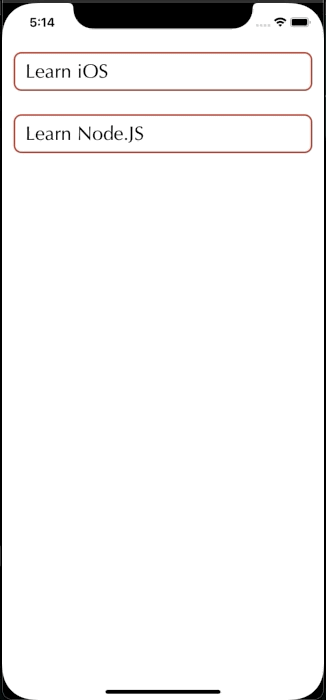

## Nested TableView - A UITableView inside UITableViewCell

* Implementation of adding a table view inside the cell of UItableview aka, Nested Table View.
* Used the Power of Autosizing table view and delegate to achieve the expansion and collapse of the cell height.

 

<table>
 <tr>
   <td>
     <h4>Demo</h4>

   </td>
 </tr>
</table>
